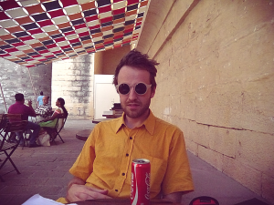

### Contact
Email: martinhjelm -- k t h . se  
Blog: [The NonConditional Beast](http://nonconditional.com)  
Github: [github.com/MartinHjelm](https://github.com/MartinHjelm)  
Publications: [scholar.google.com](https://scholar.google.com.co/citations?user=qdUckccAAAAJ&hl=en)  

### About Me
I'm a Ph.D. student at KTH Royal Institute of Technology in Computer Science. My main research interests are robotics, machine learning, and computer vision. Specifically, my main research focus is on robotic grasping, learning robots to recognize patterns in categories of everyday objects that can be exploited to perform more efficient grasps of the objects that belong to the category.

This blog focuses on programming related mistakes or technical problems I have fixed/solved so that anyone having the same specific problems might find a solution here via Google. I also blog inconsistently on machine learning and research related topics at [The NonConditional Beast](http://nonconditional.com).
